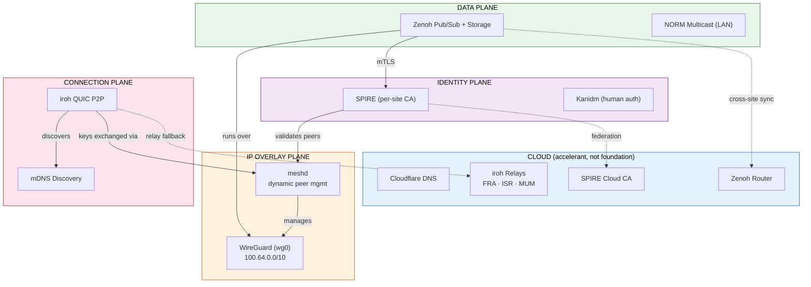

# Desert Bread Proto

A software-defined tactical data fabric for DDIL (Denied, Degraded, Intermittent, Limited) environments. The complete capability — peer discovery, encrypted transport, IP overlay, data fabric, workload identity — stands up on a LAN with no internet, no cloud, no external dependencies.

Cloud infrastructure, when reachable, adds efficiency: geographic relay for cross-site NAT traversal, federated identity, cross-site data aggregation, and operational monitoring. Cloud is an accelerant, not a foundation.

## Architecture

Four decoupled planes, each independently functional. See [docs/architecture-diagrams.md](docs/architecture-diagrams.md) for comprehensive diagrams (14 Mermaid + ASCII diagrams covering every subsystem).



```text
┌──────────────────────────────────────────────────────────────────────┐
│           CLOUD INFRASTRUCTURE (accelerant, not foundation)          │
│                                                                      │
│  Cloudflare DNS     iroh Relays (FRA/ISR/MUM)    SPIRE Cloud CA     │
│  desertbread.net    NAT traversal + fallback      Federation hub     │
│                     Zenoh Cloud Router (cross-site aggregation)       │
└──────────────────────────────────┬───────────────────────────────────┘
                                   │ only when internet available
┌──────────────────────────────────▼───────────────────────────────────┐
│  DATA PLANE (Zenoh + NORM)                                           │
│  Pub/sub with anti-entropy reconciliation + reliable LAN multicast   │
├──────────────────────────────────────────────────────────────────────┤
│  IDENTITY PLANE (SPIRE/SPIFFE + Kanidm)                              │
│  Per-site sovereign CA with federation · mTLS everywhere             │
│  Secures ALL planes: Zenoh mTLS, WG peer validation, human auth     │
├──────────────────────────────────────────────────────────────────────┤
│  IP OVERLAY PLANE (WireGuard)                                        │
│  Raw kernel WireGuard · peers managed dynamically by meshd           │
│  SPIRE validates peer SVID before meshd adds WG peer entry          │
│  Deterministic IPs from public key (100.64.0.0/10 CGNAT)            │
├──────────────────────────────────────────────────────────────────────┤
│  CONNECTION PLANE (iroh)                                             │
│  QUIC P2P · mDNS local discovery · relay NAT traversal              │
│  Ed25519 identity · multipath failover · gossip + blobs             │
└──────────────────────────────────────────────────────────────────────┘
```

### How It Works

1. **iroh** discovers peers on the local LAN via mDNS (no server, no internet) or via cloud relay servers for cross-NAT connectivity
2. **meshd** bridges iroh's QUIC connections to an IP tunnel overlay — peers exchange tunnel keys over iroh's authenticated channel, then meshd configures the tunnel interface (currently WireGuard, pluggable via `TunnelDriver` trait in `tunnel.rs`) dynamically
3. **Zenoh** provides structured pub/sub and distributed storage over the WireGuard overlay, with anti-entropy reconciliation when partitioned sites reconnect
4. **SPIRE** issues short-lived X.509 certificates to every workload, enabling mTLS on all connections. Each site has its own CA — sovereign when disconnected, federated when connected
5. **NORM** handles bulk LAN multicast (firmware, map tiles) via UDP multicast with FEC

### Key Properties

- **No single point of failure.** Every component operates without any central server.
- **Edge-first.** A site that has never seen the internet is fully functional.
- **Self-healing.** Partitioned sites reconcile automatically when reconnected.
- **Pre-provisioned.** Nodes are enrolled before deployment. Field enrollment is a first-class backup.
- **Minimal custom code.** `meshd` (~500 lines) is the only custom daemon. Everything else is proven open-source.

### Multi-Site Topology

```text
                        ┌─────────────────────────────────────────┐
                        │         CLOUD (AWS + Cloudflare)         │
                        │                                         │
                        │  Cloudflare DNS     iroh Relays          │
                        │  desertbread.net    FRA · ISR · MUM      │
                        │                                         │
                        │  SPIRE Cloud CA     Zenoh Cloud Router   │
                        │  cloud.desertbread  cross-site storage   │
                        └─────────┬───────────────┬───────────────┘
                                  │               │
                    iroh relay    │               │  iroh relay
                    (cross-NAT)   │               │  (cross-NAT)
                                  │               │
    ┌─────────────────────────────▼───┐   ┌───────▼─────────────────────────┐
    │      SITE ALPHA — Command Post  │   │  SITE BRAVO — Forward Observer  │
    │                                 │   │                                 │
    │  ┌───────────────────────────┐  │   │  ┌───────────────────────────┐  │
    │  │ CP: NVIDIA AGX Orin       │  │   │  │ CP: NVIDIA AGX Orin       │  │
    │  │ • SPIRE Server (site CA)  │  │   │  │ • SPIRE Server (site CA)  │  │
    │  │ • Zenoh Router + Storage  │◄─┼───┼─►│ • Zenoh Router + Storage  │  │
    │  │ • Kanidm Replica          │  │   │  │                           │  │
    │  │ • meshd (iroh + WG)       │  │   │  │ • meshd (iroh + WG)       │  │
    │  └──────────┬────────────────┘  │   │  └──────────┬────────────────┘  │
    │             │ Ethernet/WiFi LAN │   │             │ Ethernet LAN      │
    │  ┌──────┐ ┌┴─────┐ ┌──────┐    │   │  ┌──────┐ ┌┴─────┐             │
    │  │MFT-01│ │MFT-02│ │MFT-03│    │   │  │MFT-04│ │MFT-05│             │
    │  │RPi 5 │ │RPi 5 │ │RPi 5 │    │   │  │RPi 5 │ │RPi 5 │             │
    │  │EO/IR │ │Radar │ │Fires │    │   │  │SIGINT│ │EO/IR │             │
    │  └──────┘ └──────┘ └──────┘    │   │  └──────┘ └──────┘             │
    │                                 │   │                                 │
    │  Trust: alpha.desertbread.net   │   │  Trust: bravo.desertbread.net   │
    └─────────────────────────────────┘   └─────────────────────────────────┘
```

### Data Flow: Sensor to Decision

```text
MFT-01 (EO/IR Sensor)          CP (AGX Orin)                  MFT-03 (Fires)
────────────────────            ──────────────                 ──────────────

1. Sensor detects target
   │
   ▼
2. Zenoh publish:
   alpha/sensor/eo-ir/01
   │
   │ WireGuard tunnel
   │ 100.64.x.x → 100.64.y.y
   │
   └──────────────────────────► 3. Fusion engine correlates
                                   with radar, SIGINT
                                   │
                                   ▼
                                4. Zenoh publish:
                                   alpha/c2/tracks/fused
                                   │
                                   ▼
                                5. C2 operator sees track,
                                   authorizes engagement
                                   │
                                   │ WireGuard tunnel
                                   │ 100.64.y.y → 100.64.z.z
                                   │
                                   └────────────────────────► 6. Fires system executes

Encryption: iroh QUIC (TLS 1.3) + WireGuard (ChaCha20) + Zenoh mTLS (SPIRE)
```

## Components

| Component | Purpose | Technology |
|---|---|---|
| `meshd` | iroh-WireGuard bridge daemon | Rust, iroh, WireGuard |
| `provision` | Node provisioning bundle generator | Rust |
| `fabric-cli` | Operator CLI for mesh management | Rust |
| iroh relay | NAT traversal for cross-site links | iroh-relay binary, AWS EC2 |
| SPIRE | Workload identity (X.509 certs) | SPIFFE/SPIRE |
| Kanidm | Human operator authentication | Kanidm (Rust) |
| Zenoh | Pub/sub data fabric | Zenoh |
| NORM | Reliable LAN multicast | NRL NORM (RFC 5740) |

## Hardware Fleet

| Role | Hardware | Responsibilities |
|---|---|---|
| **Command Post (CP)** | NVIDIA Jetson AGX Orin | Sensor fusion, Zenoh storage, SPIRE server, site relay |
| **MFT** | Raspberry Pi 5 (8GB) | Sensor interface, Zenoh pub/sub endpoint, lightweight compute |
| **Cloud Relay** | AWS EC2 (t3.micro) | iroh relay, SPIRE cloud CA, Kanidm primary, Zenoh aggregation |
| **Dev Node** | CWWK x86 mini PC | Development and testing |

## Quick Start

### Development (macOS)

```bash
# Build all crates
cargo build

# Run tests
cargo test

# Run meshd in dev mode (WireGuard ops are no-ops on macOS)
cargo run --bin meshd -- --key-file /tmp/meshd-dev.key --no-relay

# Generate a provisioning bundle
cargo run --bin provision -- generate --hostname sensor-01 --role mft --site alpha
```

### Docker Dev Environment (simulated 3-node site)

```bash
docker compose -f ops/docker/dev-compose.yml up --build
```

This starts 3 containers (1 CP + 2 MFTs) on a shared bridge network with mDNS discovery enabled. Nodes will find each other and establish WireGuard overlay connectivity.

### Cross-Compile for ARM64

```bash
cargo build --target aarch64-unknown-linux-gnu --bin meshd
```

### Cloud Infrastructure

```bash
cd terraform
aws-vault exec cochlearis -- terraform init
aws-vault exec cochlearis -- terraform plan
aws-vault exec cochlearis -- terraform apply
```

Deploys iroh relay servers to 3 AWS regions:
- `eu-central-1` (Frankfurt) — `relay.desertbread.net`
- `il-central-1` (Tel Aviv) — `relay-isr.desertbread.net`
- `ap-south-1` (Mumbai) — `relay-mum.desertbread.net`

## Repository Structure

```text
├── CLAUDE.md                    # Project conventions for AI-assisted dev
├── Cargo.toml                   # Rust workspace root
├── crates/
│   ├── meshd/                   # iroh–tunnel bridge daemon
│   │   └── src/
│   │       ├── main.rs          # Daemon entry point
│   │       ├── tunnel.rs        # TunnelDriver trait (swap WG for MASQUE, etc.)
│   │       ├── wireguard.rs     # WireGuard TunnelDriver implementation
│   │       ├── discovery.rs     # mDNS + relay peer discovery
│   │       ├── protocol.rs      # Mesh handshake protocol (tunnel-agnostic)
│   │       ├── peer.rs          # Peer state table
│   │       └── overlay_ip.rs    # Deterministic IP assignment
│   ├── provision/               # Node provisioning tool
│   └── fabric-cli/              # Operator CLI
├── terraform/
│   ├── main.tf                  # Multi-region relay infrastructure
│   └── modules/relay/           # Per-region iroh relay module
├── config/
│   ├── zenoh/                   # Zenoh router/client configs
│   └── spire/                   # SPIRE server/agent configs
├── ops/
│   ├── docker/                  # Dev containers (3-node sim)
│   ├── scripts/                 # Operational scripts
│   └── ansible/                 # Fleet deployment playbooks
├── docs/
│   ├── adr/                     # Architecture Decision Records
│   └── runbooks/                # Operational runbooks
├── tests/
│   ├── integration/             # Cross-component integration tests
│   └── e2e/                     # Full site deployment tests
└── .github/workflows/ci.yml    # CI: build, test, cross-compile, terraform validate
```

## Implementation Phases

| Phase | Scope | Status |
|---|---|---|
| **Phase 0** | Repo skeleton, build system, dev environment | **Complete** |
| **Phase 1** | Connection layer (iroh + WireGuard + meshd) | **Complete** |
| **Phase 2** | Identity layer (SPIRE/SPIFFE + Kanidm) | Planned |
| **Phase 3** | Data layer (Zenoh + NORM) | Planned |
| **Phase 4** | Hardening (FIPS 140-3, PQC, STIG, monitoring) | Planned |

## Design Decisions

All architecture decisions are documented in [docs/adr/](docs/adr/):

1. [iroh over Nebula/Netbird/Headscale](docs/adr/001-iroh-over-nebula.md)
2. [Raw WireGuard bootstrapped by iroh](docs/adr/002-wireguard-bootstrap-via-iroh.md)
3. [SPIRE per-site with federation](docs/adr/003-spire-per-site-federation.md)
4. [Kanidm over Ory/Dex](docs/adr/004-kanidm-over-ory-dex.md)
5. [NORM for LAN multicast](docs/adr/005-norm-for-lan-multicast.md)
6. [Deterministic overlay IPs](docs/adr/006-deterministic-overlay-ip.md)

## Island Mode

Island mode is not a fallback — it is the primary operating assumption. Every site operates indefinitely with no external connectivity:

| Capability | Works without internet? |
|---|---|
| Peer discovery (mDNS) | Yes |
| WireGuard overlay | Yes |
| Zenoh pub/sub + storage | Yes |
| SPIRE cert issuance | Yes |
| Kanidm authentication | Yes |
| NORM multicast | Yes |
| Cross-site data exchange | Requires connectivity |
| Cloud relay NAT traversal | Requires connectivity |
| SPIRE federation | Requires connectivity |

When connectivity returns, everything reconciles automatically. No manual intervention.

## Network Transports

The stack is transport-agnostic. iroh handles discovery and NAT traversal regardless of underlay:

| Transport | Where Used |
|---|---|
| Ethernet LAN | Site-internal: CP to MFTs |
| WiFi | Dismounted MFTs |
| Star Shield (Starlink) | Site-to-cloud, site-to-site |
| 5G/LTE puck | Backup WAN, mobile connectivity |
| iroh cloud relay | Fallback when direct P2P fails |
