# Architecture Diagrams

Comprehensive visual reference for the Desert Bread Proto tactical data fabric. Every diagram has both a Mermaid version (renders on GitHub) and a plaintext ASCII version (renders anywhere).

## Key Terms

| Term | What it is |
|---|---|
| **iroh** | QUIC-based P2P library. Handles peer discovery, NAT traversal, and encrypted transport. Nodes addressed by public key, not IP. |
| **QUIC** | UDP-based transport protocol with built-in encryption (TLS 1.3), multiplexed streams, and connection migration. |
| **mDNS** | Multicast DNS. Local service discovery on LAN without any server or internet. How nodes find each other when deployed. |
| **WireGuard** | Kernel-level encrypted tunnel protocol. Provides the IP overlay so legacy tools (SSH, ATAK) work over the mesh. |
| **CGNAT** | Carrier-Grade NAT. 100.64.0.0/10. Used for overlay IPs because it never conflicts with real routable addresses. |
| **SPIRE/SPIFFE** | Workload identity framework. Issues short-lived X.509 certificates to every process. No static secrets. |
| **Zenoh** | Pub/sub data fabric with distributed storage and anti-entropy reconciliation. The application data layer. |
| **NORM** | NACK-Oriented Reliable Multicast (RFC 5740). Bulk LAN distribution with FEC. For firmware, map tiles, large files. |
| **DDIL** | Denied, Degraded, Intermittent, Limited. The network conditions this system is designed for. |
| **ALPN** | Application-Layer Protocol Negotiation. TLS extension used by iroh to multiplex protocols on a single QUIC endpoint. |
| **SVID** | SPIFFE Verifiable Identity Document. An X.509 certificate or JWT issued by SPIRE. |
| **FEC** | Forward Error Correction. Redundant data added to multicast streams so receivers can reconstruct lost packets without retransmission. |

---

**Contents:**

1. [System Overview](#1-system-overview) — Four planes, edge sites, cloud infrastructure
2. [meshd Architecture](#2-meshd-architecture) — Internal modules of the bridge daemon
3. [Connection Plane (iroh)](#3-connection-plane-iroh) — Discovery, relay, QUIC transport
4. [Peer Handshake Protocol](#4-peer-handshake-protocol) — How two nodes establish connectivity
5. [IP Overlay (WireGuard)](#5-ip-overlay-wireguard) — How iroh bootstraps WireGuard
6. [Deterministic IP Assignment](#6-deterministic-ip-assignment) — Public key to overlay IP derivation
7. [Multi-Site Topology](#7-multi-site-topology) — Physical sites, relays, cross-site links
8. [Island Mode](#8-island-mode) — Full operation with no internet
9. [Identity and Trust](#9-identity-and-trust) — SPIRE trust domains, federation, cert hierarchy
10. [Data Flow: Sensor to Decision](#10-data-flow-sensor-to-decision) — End-to-end mission data path
11. [Provisioning and Enrollment](#11-provisioning-and-enrollment) — How nodes get their identity
12. [Security Boundaries](#12-security-boundaries) — Trust zones and encryption layers
13. [Cloud Infrastructure](#13-cloud-infrastructure) — AWS relay servers and Cloudflare DNS
14. [Docker Dev Environment](#14-docker-dev-environment) — 3-node simulation topology

---

## 1. System Overview

Four decoupled planes. Each functions independently. Cloud adds reach and efficiency but is never required. Every site is sovereign — works indefinitely on a LAN with zero external dependencies.

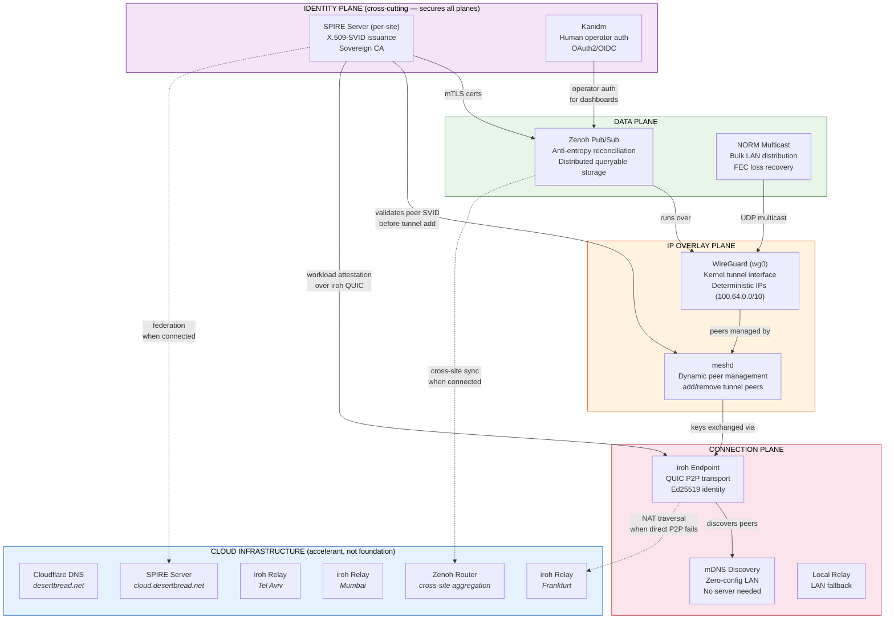

```
┌──────────────────────────────────────────────────────────────────────┐
│           CLOUD INFRASTRUCTURE (accelerant, not foundation)          │
│                                                                      │
│  Cloudflare DNS     iroh Relays (FRA/ISR/MUM)    SPIRE Cloud CA     │
│  desertbread.net    NAT traversal + fallback      Federation hub     │
│                     Zenoh Cloud Router (cross-site aggregation)       │
└──────────────────────────────────┬───────────────────────────────────┘
                                   │ only when internet available
                                   │ (mesh works without this)
┌──────────────────────────────────▼───────────────────────────────────┐
│  DATA PLANE (Zenoh + NORM)                                           │
│  Pub/sub with anti-entropy reconciliation + reliable LAN multicast   │
├──────────────────────────────────────────────────────────────────────┤
│  IDENTITY PLANE (SPIRE/SPIFFE + Kanidm)                              │
│  Per-site sovereign CA with federation · mTLS everywhere             │
│  Secures ALL planes: Zenoh mTLS, WG peer validation, human auth     │
├──────────────────────────────────────────────────────────────────────┤
│  IP OVERLAY PLANE (WireGuard)                                        │
│  Raw kernel WireGuard · peers managed dynamically by meshd           │
│  SPIRE validates peer SVID before meshd adds WG peer entry          │
│  Deterministic IPs from public key (100.64.0.0/10 CGNAT)            │
├──────────────────────────────────────────────────────────────────────┤
│  CONNECTION PLANE (iroh)                                             │
│  QUIC P2P · mDNS local discovery · relay NAT traversal              │
│  Ed25519 identity · multipath failover · gossip + blobs             │
└──────────────────────────────────────────────────────────────────────┘
```

Key point: mission traffic never leaves the edge. Cloud relays only assist with NAT traversal and cross-site connectivity. They relay encrypted QUIC streams — they cannot decrypt any traffic.

---

## 2. meshd Architecture

`meshd` is the only custom daemon (~500 lines of Rust). It bridges iroh's QUIC connections to an IP tunnel overlay (currently WireGuard, but the tunnel technology is pluggable via the `TunnelDriver` trait in `tunnel.rs`). All other components are proven open-source software used as-is.

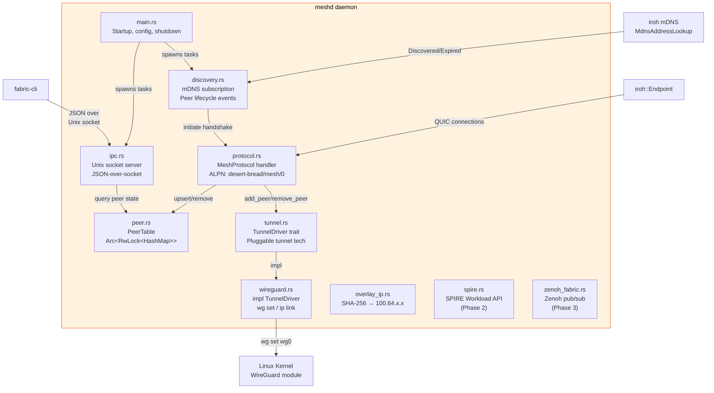

```
                                fabric-cli
                                    │ JSON over Unix socket
                                    ▼
┌──────────────────────────────────────────────────────────────┐
│                        meshd daemon                          │
│                                                              │
│  ┌──────────────┐  ┌──────────────┐  ┌───────────────────┐  │
│  │   main.rs    │  │  protocol.rs │  │   discovery.rs    │  │
│  │              │  │              │  │                   │  │
│  │  Startup     │  │  ALPN:       │  │  mDNS subscribe   │  │
│  │  Config      │  │  desert-     │  │  On Discovered:   │  │
│  │  Key persist │  │  bread/      │  │    handshake if   │  │
│  │  Shutdown    │  │  mesh/0      │  │    our_id < peer  │  │
│  │              │  │              │  │  On Expired:       │  │
│  │  Spawns:     │  │  accept()    │  │    mark offline   │  │
│  │  • discovery │  │  handshake_  │  │    remove tunnel  │  │
│  │  • ipc       │  │  outbound()  │  │    peer           │  │
│  └──────┬───────┘  └──────┬───────┘  └────────┬──────────┘  │
│         │                 │                    │              │
│  ┌──────▼─────────────────▼────────────────────▼──────────┐  │
│  │                      peer.rs                           │  │
│  │  PeerTable: Arc<RwLock<HashMap<EndpointId, PeerInfo>>> │  │
│  │  upsert() · mark_disconnected() · remove() · list()   │  │
│  └──────────────────────┬─────────────────────────────────┘  │
│                         │                                    │
│  ┌──────────────────────▼──────────┐  ┌────────────────┐     │
│  │  tunnel.rs (TunnelDriver trait) │  │  overlay_ip.rs │     │
│  │  add_peer() · remove_peer()     │  │                │     │
│  │  update_peer_endpoint()         │  │  SHA-256 hash  │     │
│  │  teardown() · public_key()      │  │  → 22-bit host │     │
│  │         ┌───────────────────┐   │  │  → 100.64.x.x  │     │
│  │         │ wireguard.rs      │   │  └────────────────┘     │
│  │         │ impl TunnelDriver │   │                         │
│  │         │ Shells: wg, ip    │   │                         │
│  │         │ No-op on macOS    │   │                         │
│  │         └───────────────────┘   │                         │
│  └────────────┬────────────────────┘  ┌────────────────────┐ │
│               │                       │     ipc.rs         │ │
│               ▼                       │  Unix socket       │ │
│  ┌────────────────────────┐           │  /var/run/meshd/   │ │
│  │  Linux Kernel          │           │  meshd.sock        │ │
│  │  WireGuard module      │           │                    │ │
│  │  wg0 interface         │           │  Cmds: status,     │ │
│  └────────────────────────┘           │  peers, identity   │ │
│                                       └────────────────────┘ │
│  ┌────────────────────┐  ┌─────────────────────────────────┐ │
│  │  spire.rs (Ph2)    │  │  zenoh_fabric.rs (Ph3)          │ │
│  │  SPIRE Workload    │  │  Zenoh pub/sub integration      │ │
│  │  API client        │  │  mTLS via SPIRE certs           │ │
│  └────────────────────┘  └─────────────────────────────────┘ │
└──────────────────────────────────────────────────────────────┘
```

### Module responsibilities

| Module | Lines | Purpose |
| --- | --- | --- |
| `main.rs` | ~100 | Entry point: key persistence, endpoint setup, router, task spawning, shutdown |
| `tunnel.rs` | ~60 | `TunnelDriver` trait: pluggable tunnel abstraction (WireGuard, MASQUE, etc.) |
| `wireguard.rs` | ~100 | `impl TunnelDriver` for WireGuard via `wg` and `ip` CLI tools; no-op on macOS |
| `protocol.rs` | ~130 | `ProtocolHandler` impl: accept inbound + initiate outbound handshakes (tunnel-agnostic) |
| `discovery.rs` | ~50 | mDNS event loop: peer discovered → handshake, peer expired → cleanup |
| `peer.rs` | ~60 | Thread-safe peer table with CRUD operations |
| `overlay_ip.rs` | ~30 | Deterministic IP from SHA-256 of public key |
| `ipc.rs` | ~160 | Unix socket server, JSON request/response protocol |
| `spire.rs` | ~30 | Stub: SPIRE Workload API client (Phase 2) |
| `zenoh_fabric.rs` | ~30 | Stub: Zenoh integration (Phase 3) |

---

## 3. Connection Plane (iroh)

iroh handles all peer-to-peer connectivity. Nodes are addressed by Ed25519 public key, not by IP. iroh discovers peers via mDNS on LAN and via relay servers across NAT boundaries.

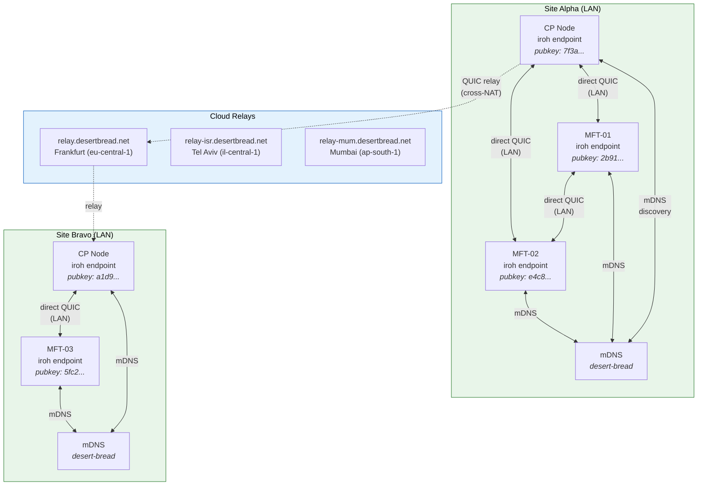

```
               Site Alpha (LAN)                        Site Bravo (LAN)
    ┌──────────────────────────────┐        ┌──────────────────────────┐
    │                              │        │                          │
    │  CP (7f3a...)                │        │  CP (a1d9...)            │
    │    ▲         ▲               │        │    ▲                     │
    │    │ QUIC    │ QUIC          │        │    │ QUIC                │
    │    ▼         ▼               │        │    ▼                     │
    │  MFT-01    MFT-02            │        │  MFT-03                  │
    │  (2b91...)  (e4c8...)        │        │  (5fc2...)               │
    │    ▲         ▲               │        │    ▲                     │
    │    └────┬────┘ QUIC          │        │    │                     │
    │         │                    │        │    │                     │
    │   [mDNS: desert-bread]       │        │   [mDNS: desert-bread]   │
    └─────────┼────────────────────┘        └────┼─────────────────────┘
              │                                  │
              │ direct P2P fails (NAT)           │
              │                                  │
    ──────────┼──────── Internet ────────────────┼─────────
              │                                  │
              ▼                                  ▼
    ┌──────────────────────────────────────────────────────┐
    │              iroh Relay Servers (AWS)                 │
    │                                                      │
    │  relay.desertbread.net     (Frankfurt, eu-central-1) │
    │  relay-isr.desertbread.net (Tel Aviv, il-central-1)  │
    │  relay-mum.desertbread.net (Mumbai, ap-south-1)      │
    │                                                      │
    │  Stateless · Cannot decrypt · Horizontally scalable  │
    └──────────────────────────────────────────────────────┘

    LAN: mDNS discovery → direct QUIC P2P (no server, no internet)
    WAN: iroh relay → encrypted QUIC relay (fallback when P2P fails)
```

### iroh connectivity decision tree

```
New peer discovered
├── Same LAN? (mDNS)
│   └── YES → Direct QUIC connection (UDP, ~1ms latency)
├── Different network, NAT permitting?
│   └── YES → QUIC holepunching (~90% success rate)
└── NAT blocks direct connection?
    └── Use iroh relay server (encrypted relay, higher latency)
        └── Relay cannot decrypt traffic (end-to-end QUIC encryption)
```

---

## 4. Peer Handshake Protocol

When two nodes discover each other, they perform a handshake over iroh's authenticated QUIC channel. The handshake exchanges tunnel public keys and overlay IPs (tunnel-agnostic — `tunnel_pubkey` and `tunnel_endpoint` are opaque strings interpreted by the active `TunnelDriver`). After the handshake, `meshd` configures the tunnel interface to allow direct IP communication.

ALPN protocol: `desert-bread/mesh/0`

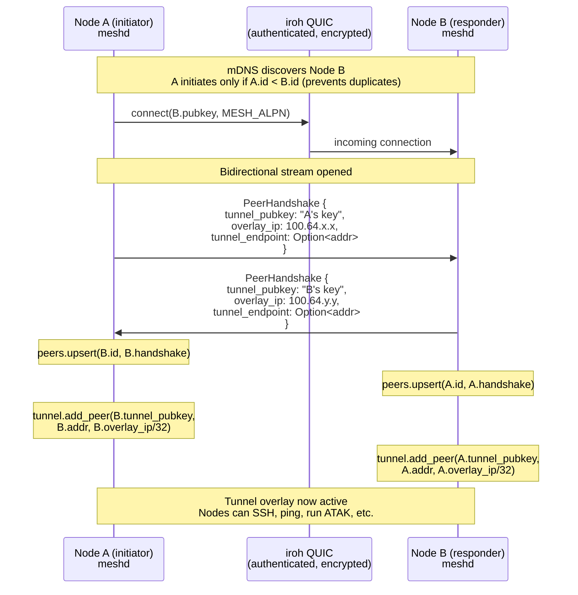

```
Node A (initiator)                    iroh QUIC                     Node B (responder)
─────────────────                    ─────────                     ─────────────────

 mDNS: "B discovered"
 (only initiate if A.id < B.id)

 connect(B.pubkey, MESH_ALPN)──────────────────────────────────►  accept(conn)
                                                                   accept_bi()
 open_bi() ───────────────────── bidirectional stream ───────────►

 send PeerHandshake ──────────── postcard binary ────────────────► recv PeerHandshake
   { tunnel_pubkey, overlay_ip }                                    deserialize A's info

                                 ◄──── postcard binary ────────── send PeerHandshake
 recv PeerHandshake                                                 { tunnel_pubkey, overlay_ip }
 deserialize B's info

 peers.upsert(B)                                                   peers.upsert(A)
 tunnel.add_peer(B.tunnel_pubkey,                                  tunnel.add_peer(A.tunnel_pubkey,
   B.addr, B.overlay_ip/32)                                          A.addr, A.overlay_ip/32)

 conn.close(0, "done") ─────────────────────────────────────────►  stream completes

 ═══════════════════════════════════════════════════════════════════════════════
                 Tunnel overlay now active between A and B
                 SSH, ping, ATAK, Zenoh — all work over 100.64.x.x
 ═══════════════════════════════════════════════════════════════════════════════
```

### Duplicate prevention

When mDNS discovers a peer, both nodes see each other simultaneously. To prevent duplicate handshakes (both trying to initiate), only the node with the **lower** iroh public key initiates the connection. The other node waits for the incoming connection.

```
A discovers B via mDNS
B discovers A via mDNS

if A.id < B.id:
    A initiates handshake → B accepts
else:
    B initiates handshake → A accepts

Result: exactly one handshake per peer pair
```

---

## 5. IP Overlay (WireGuard)

The IP tunnel provides the overlay. It is NOT the mesh — iroh is the mesh. The tunnel is a utility layer bootstrapped by iroh so that legacy IP-based tools work over the mesh. The tunnel technology is pluggable via `TunnelDriver` (see `tunnel.rs`). WireGuard is the current production driver; MASQUE over iroh or userspace WireGuard are possible future alternatives.

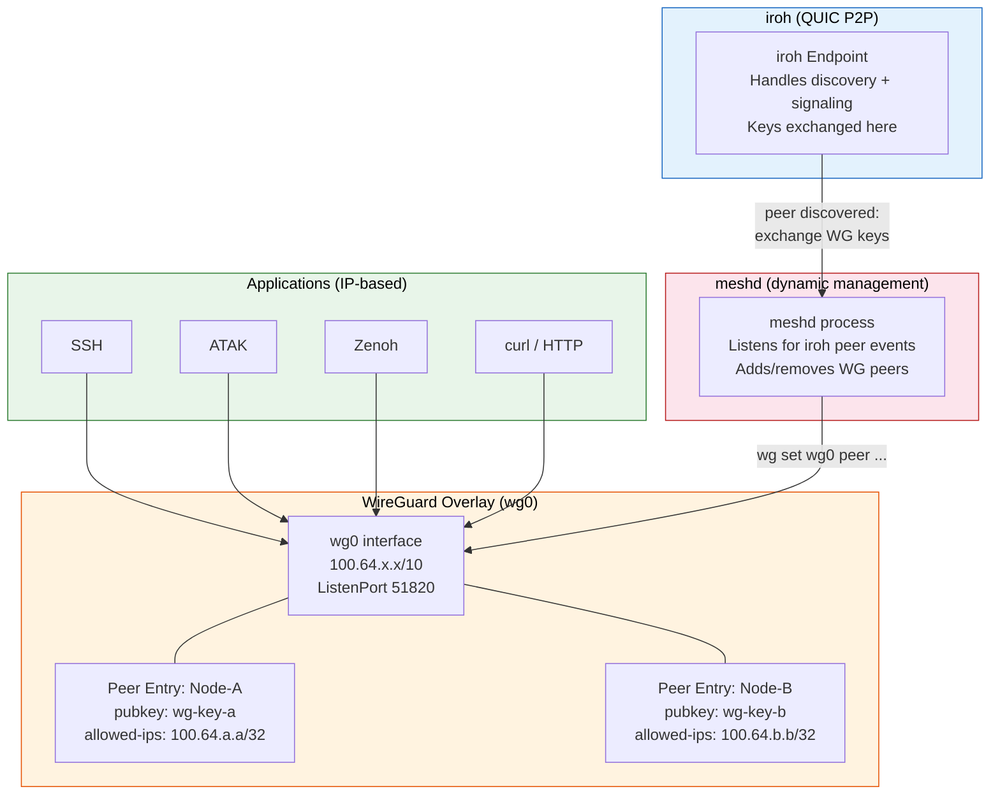

```
┌─────────────────────────────────────────────────────┐
│          Applications (IP-based)                     │
│  SSH · ATAK · Zenoh · curl · ping · any IP tool     │
└──────────────────────┬──────────────────────────────┘
                       │ standard IP routing
┌──────────────────────▼──────────────────────────────┐
│          WireGuard Overlay (wg0)                     │
│                                                      │
│  Interface: wg0                                      │
│  Address:   100.64.x.x/10   (deterministic)         │
│  Listen:    51820/udp                                │
│                                                      │
│  Peer entries (added dynamically by meshd):          │
│  ┌────────────────────────────────────────────────┐  │
│  │ peer wg-key-a  endpoint 192.168.1.10:51820    │  │
│  │                allowed-ips 100.64.a.a/32      │  │
│  ├────────────────────────────────────────────────┤  │
│  │ peer wg-key-b  endpoint 192.168.1.11:51820    │  │
│  │                allowed-ips 100.64.b.b/32      │  │
│  └────────────────────────────────────────────────┘  │
└──────────────────────┬──────────────────────────────┘
                       │ wg set wg0 peer ...
┌──────────────────────▼──────────────────────────────┐
│          meshd (bridge daemon)                       │
│                                                      │
│  On peer discovered:                                 │
│    1. Exchange tunnel pubkeys over iroh QUIC         │
│    2. Compute peer's overlay IP from iroh pubkey     │
│    3. tunnel.add_peer(pubkey, endpoint, overlay_ip)  │
│       (dispatches to active TunnelDriver impl)       │
│                                                      │
│  On peer lost:                                       │
│    1. tunnel.remove_peer(pubkey)                     │
│    2. Remove from peer table                         │
└──────────────────────┬──────────────────────────────┘
                       │ QUIC connections
┌──────────────────────▼──────────────────────────────┐
│          iroh (Connection Plane)                     │
│  mDNS discovery · relay fallback · QUIC transport    │
└─────────────────────────────────────────────────────┘
```

### What meshd manages vs what it doesn't

| meshd manages | meshd does NOT manage |
| --- | --- |
| Tunnel peer entries via `TunnelDriver` (add/remove) | Tunnel interface creation (done at startup via driver constructor) |
| Peer tunnel key exchange (over iroh) | Tunnel keypair generation (driver-specific) |
| Overlay IP computation | IP routing tables |
| Peer discovery lifecycle | Application-layer data |
| IPC for fabric-cli queries | TLS/mTLS (that's SPIRE's job) |

---

## 6. Deterministic IP Assignment

Every node's overlay IP is derived deterministically from its iroh public key. No DHCP, no allocation server, no state to synchronize. Any node can compute any other node's IP from its public key.

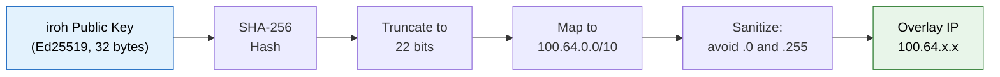

```
iroh Public Key (Ed25519, 32 bytes)
         │
         ▼
   SHA-256 Hash (32 bytes)
         │
         ▼
   Take first 4 bytes as u32 (big-endian)
         │
         ▼
   Mask to 22 bits: raw & 0x003F_FFFF
         │
         ▼
   Sanitize last octet:
     if .0   → set bit 0 (becomes .1)
     if .255 → clear bit 0 (becomes .254)
         │
         ▼
   OR with base: 0x6440_0000 | host
         │
         ▼
   Result: 100.64.x.x (within 100.64.0.0/10)
         │
   ┌─────┴────────────────────────────────────┐
   │ Range:  100.64.0.1 — 100.127.255.254     │
   │ Size:   ~4 million addresses (22-bit)     │
   │ Type:   CGNAT (never conflicts with LAN)  │
   │ Source: ADR-006                           │
   └──────────────────────────────────────────┘
```

### Why CGNAT (100.64.0.0/10)?

| Range | Problem |
|---|---|
| 10.0.0.0/8 | Conflicts with military base networks, hotel WiFi, corporate LANs |
| 172.16.0.0/12 | Conflicts with Docker defaults, many enterprise networks |
| 192.168.0.0/16 | Conflicts with virtually every home/office LAN |
| **100.64.0.0/10** | CGNAT range. Nobody uses it for LAN addressing. Zero conflict risk. |

### Collision probability

22-bit address space = 4,194,304 unique addresses. For a fleet of 1,000 nodes, the probability of at least one collision (birthday problem) is approximately:

```
P(collision) ≈ 1 - e^(-n² / 2k)
             ≈ 1 - e^(-1000000 / 8388608)
             ≈ 0.00012 (0.012%)
```

For tactical deployments (10-100 nodes per site), collision risk is negligible.

---

## 7. Multi-Site Topology

A typical deployment: multiple physical sites connected via unreliable WAN links. Each site is self-contained. Cloud provides relay services and data aggregation when reachable.

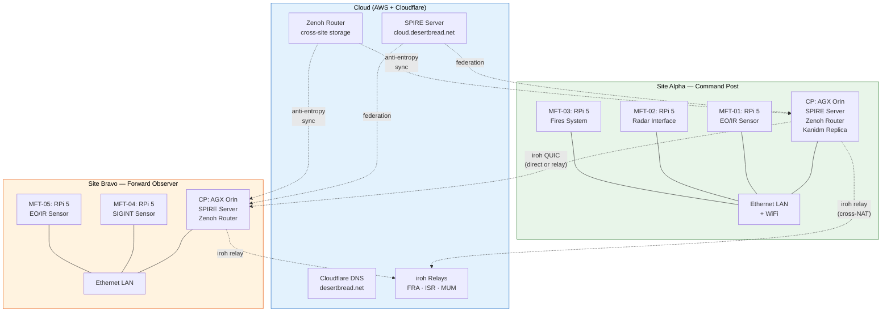

```
                        ┌─────────────────────────────────────────┐
                        │         CLOUD (AWS + Cloudflare)         │
                        │                                         │
                        │  Cloudflare DNS     iroh Relays          │
                        │  desertbread.net    FRA · ISR · MUM      │
                        │                                         │
                        │  SPIRE Cloud CA     Zenoh Cloud Router   │
                        │  cloud.desertbread  cross-site storage   │
                        └─────────┬───────────────┬───────────────┘
                                  │               │
                    iroh relay    │               │  iroh relay
                    (cross-NAT)   │               │  (cross-NAT)
                                  │               │
    ┌─────────────────────────────▼───┐   ┌───────▼─────────────────────────┐
    │      SITE ALPHA — Command Post  │   │  SITE BRAVO — Forward Observer  │
    │                                 │   │                                 │
    │  ┌───────────────────────────┐  │   │  ┌───────────────────────────┐  │
    │  │ CP: NVIDIA AGX Orin       │  │   │  │ CP: NVIDIA AGX Orin       │  │
    │  │ • SPIRE Server (site CA)  │  │   │  │ • SPIRE Server (site CA)  │  │
    │  │ • Zenoh Router + Storage  │◄─┼───┼─►│ • Zenoh Router + Storage  │  │
    │  │ • Kanidm Replica          │  │   │  │                           │  │
    │  │ • meshd (iroh + WG)       │  │   │  │ • meshd (iroh + WG)       │  │
    │  └──────────┬────────────────┘  │   │  └──────────┬────────────────┘  │
    │             │ Ethernet/WiFi LAN │   │             │ Ethernet LAN      │
    │  ┌──────┐ ┌┴─────┐ ┌──────┐    │   │  ┌──────┐ ┌┴─────┐             │
    │  │MFT-01│ │MFT-02│ │MFT-03│    │   │  │MFT-04│ │MFT-05│             │
    │  │RPi 5 │ │RPi 5 │ │RPi 5 │    │   │  │RPi 5 │ │RPi 5 │             │
    │  │EO/IR │ │Radar │ │Fires │    │   │  │SIGINT│ │EO/IR │             │
    │  └──────┘ └──────┘ └──────┘    │   │  └──────┘ └──────┘             │
    │                                 │   │                                 │
    │  Trust: alpha.desertbread.net   │   │  Trust: bravo.desertbread.net   │
    └─────────────────────────────────┘   └─────────────────────────────────┘

    LAN traffic: mDNS discovery → direct QUIC → WireGuard overlay
    Cross-site:  iroh relay or direct QUIC (if routable)
    Cloud sync:  SPIRE federation + Zenoh anti-entropy (when connected)
```

### Transport options between sites

| Link | Technology | Latency | Notes |
|---|---|---|---|
| Same LAN | Ethernet / WiFi | < 1ms | mDNS discovery, direct QUIC |
| Star Shield (Starlink) | pLEO satellite | 30-60ms | Inter-satellite mesh, no ground station hairpin |
| 5G/LTE puck | Cellular backhaul | 20-100ms | Mobile, backup WAN |
| iroh cloud relay | QUIC relay (AWS) | 50-200ms | Fallback when direct P2P fails across NAT |

---

## 8. Island Mode

Island mode is not a fallback — it is the primary operating assumption. Every site operates indefinitely with no external connectivity. This diagram shows what works and what doesn't when the internet is gone.

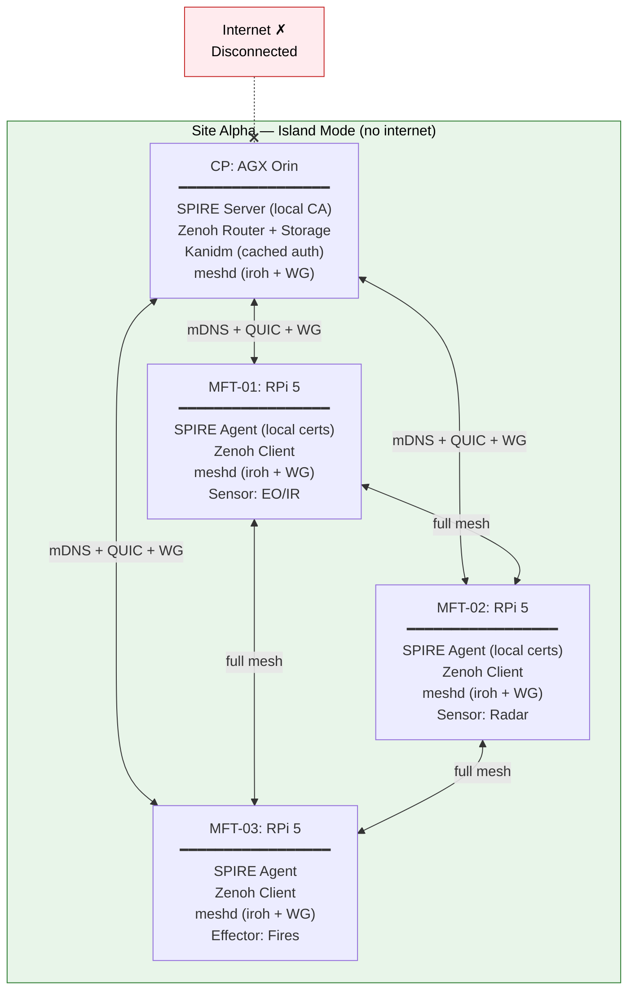

```
                    Internet ╳ (disconnected)
                         │
    ═════════════════════╪═══════════════════════════
                         │ (nothing gets through)
    ┌────────────────────┼──────────────────────────┐
    │                    ╳                          │
    │    SITE ALPHA — ISLAND MODE                   │
    │    Everything works. No internet needed.       │
    │                                               │
    │    ┌─────────────────────────────────────┐    │
    │    │  CP: NVIDIA AGX Orin                │    │
    │    │  • SPIRE Server → issues certs      │    │
    │    │  • Zenoh Router → stores data       │    │
    │    │  • Kanidm → authenticates operators  │    │
    │    │  • meshd → manages WG peers          │    │
    │    └──────────┬──────────┬───────────────┘    │
    │               │          │                    │
    │       ┌───────▼──┐  ┌───▼───────┐            │
    │       │ MFT-01   │  │ MFT-02    │            │
    │       │ EO/IR    │  │ Radar     │            │
    │       │ Zenoh    │  │ Zenoh     │            │
    │       │ pub/sub  │  │ pub/sub   │            │
    │       └─────┬────┘  └─────┬─────┘            │
    │             │             │                    │
    │       ┌─────▼─────────────▼─────┐             │
    │       │       MFT-03            │             │
    │       │       Fires System      │             │
    │       │       Zenoh sub         │             │
    │       └─────────────────────────┘             │
    │                                               │
    │    Discovery: mDNS (no server needed)         │
    │    Transport: direct QUIC on LAN              │
    │    Overlay:   WireGuard (kernel, local)        │
    │    Identity:  SPIRE (sovereign CA)             │
    │    Data:      Zenoh (local pub/sub + storage) │
    │    Multicast: NORM (UDP, LAN-only)            │
    │                                               │
    └───────────────────────────────────────────────┘

    When internet returns → Zenoh anti-entropy syncs automatically
                          → SPIRE federates trust bundles
                          → No manual intervention needed
```

### Island mode capability matrix

| Capability | Island Mode | Connected Mode | Difference |
|---|---|---|---|
| Peer discovery (mDNS) | Full | Full | None |
| WireGuard overlay | Full | Full | None |
| Zenoh pub/sub | Full (local) | Full (local + cross-site) | Cross-site sync when connected |
| Zenoh storage | Full (local) | Full + cloud aggregation | Cloud storage adds redundancy |
| SPIRE cert issuance | Full (site CA) | Full + federation | Federation adds cross-site trust |
| Kanidm auth | Full (cached) | Full + cloud sync | Cloud sync adds user management |
| NORM multicast | Full | Full | None (LAN-only by design) |
| Cross-site data | Queued | Live | Anti-entropy reconciles on reconnect |

---

## 9. Identity and Trust

Three layers of identity, each serving a different purpose. No static secrets anywhere — every credential is short-lived and automatically rotated.

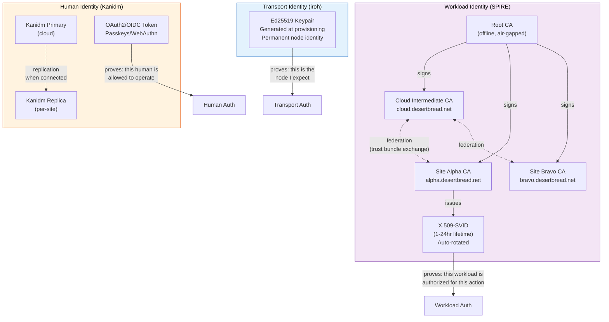

```
┌────────────────────────────────────────────────────────────────────┐
│  TRANSPORT IDENTITY (iroh)                                         │
│                                                                    │
│  Ed25519 keypair — generated at provisioning, permanent.           │
│  Proves: "this QUIC connection is from the node I expect."         │
│  Every iroh connection is authenticated by proving key possession.  │
└────────────────────────────────────────────────────────────────────┘

┌────────────────────────────────────────────────────────────────────┐
│  WORKLOAD IDENTITY (SPIRE/SPIFFE)                                  │
│                                                                    │
│  Root CA (offline, air-gapped)                                     │
│  ├── Cloud Intermediate CA (SPIRE Server @ cloud.desertbread.net)  │
│  ├── Site Alpha Intermediate CA (SPIRE Server @ alpha.desertbread) │
│  ├── Site Bravo Intermediate CA (SPIRE Server @ bravo.desertbread) │
│  └── ...                                                           │
│                                                                    │
│  Each SPIRE server:                                                │
│  • Issues X.509-SVIDs (1-24 hour lifetime, auto-rotated)           │
│  • Attests node identity (hardware, OS, process)                   │
│  • Sovereign when disconnected (its own trust domain)              │
│  • Federates by exchanging trust bundles (not shared state)        │
│                                                                    │
│  Proves: "this workload is what it claims, authorized for this."   │
│                                                                    │
│  Federation model (no split-brain):                                │
│  ┌───────────┐     trust bundles      ┌───────────┐               │
│  │ alpha CA  │◄──────────────────────►│ cloud CA  │               │
│  └───────────┘                        └─────┬─────┘               │
│                                             │                      │
│  ┌───────────┐     trust bundles      ┌─────▼─────┐               │
│  │ bravo CA  │◄──────────────────────►│ cloud CA  │               │
│  └───────────┘                        └───────────┘               │
│                                                                    │
│  Each CA is authoritative for its own trust domain.                │
│  No shared state to diverge. Federation = "I trust your certs."    │
└────────────────────────────────────────────────────────────────────┘

┌────────────────────────────────────────────────────────────────────┐
│  HUMAN IDENTITY (Kanidm)                                           │
│                                                                    │
│  For operator authentication to web UIs / dashboards.              │
│  Cloud primary ──replication──► per-site read replicas.            │
│  OAuth2/OIDC tokens, passkeys/WebAuthn, TOTP.                     │
│  Works offline via cached replica.                                 │
│                                                                    │
│  Proves: "this person is an authorized operator."                  │
└────────────────────────────────────────────────────────────────────┘
```

### How identity layers interact

```
Incoming connection from Peer X:

1. TRANSPORT (iroh): Is X's public key in my known peers?
   └── YES → QUIC connection accepted (encrypted, authenticated)

2. WORKLOAD (SPIRE): Does X have a valid SVID from a trusted CA?
   └── YES → WireGuard peer added, Zenoh mTLS established

3. HUMAN (Kanidm): Is the operator accessing a web UI authenticated?
   └── YES → Dashboard/COP access granted with role-based permissions

All three layers must pass. A stolen iroh key without SPIRE attestation
cannot join the WireGuard overlay. A valid SVID without an iroh key
cannot establish a QUIC connection.
```

---

## 10. Data Flow: Sensor to Decision

End-to-end path from a sensor detection to an engagement decision. Shows how data moves through the four planes.

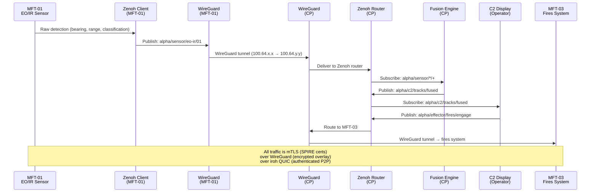

```
MFT-01 (EO/IR Sensor)          CP (AGX Orin)                  MFT-03 (Fires)
────────────────────            ──────────────                 ──────────────

1. Sensor detects target
   │
   ▼
2. Zenoh publish:
   alpha/sensor/eo-ir/01
   { bearing: 045, range: 2.3km,
     class: "UAS" }
   │
   │ WireGuard tunnel
   │ 100.64.x.x → 100.64.y.y
   │
   └──────────────────────────► 3. Zenoh router receives
                                   │
                                   ▼
                                4. Fusion engine subscribes:
                                   alpha/sensor/*/+
                                   Correlates with radar data
                                   │
                                   ▼
                                5. Zenoh publish:
                                   alpha/c2/tracks/fused
                                   { id: T-0042, class: "UAS",
                                     pos: [lat, lon, alt],
                                     confidence: 0.94 }
                                   │
                                   ▼
                                6. C2 operator sees track
                                   on COP display
                                   │
                                   ▼
                                7. Operator authorizes engagement
                                   Zenoh publish:
                                   alpha/effector/fires/engage
                                   { target: T-0042,
                                     weapon: "MEROPS" }
                                   │
                                   │ WireGuard tunnel
                                   │ 100.64.y.y → 100.64.z.z
                                   │
                                   └────────────────────────► 8. Fires system receives
                                                                 engagement order
                                                                 Executes

Encryption layers (concurrent, defense-in-depth):
  Layer 1: iroh QUIC (TLS 1.3, Ed25519 identity)
  Layer 2: WireGuard (ChaCha20-Poly1305 / AES-256-GCM)
  Layer 3: Zenoh mTLS (SPIRE X.509-SVID, short-lived certs)
```

---

## 11. Provisioning and Enrollment

Nodes are provisioned before deployment. Each node receives a bundle containing everything it needs to join the mesh. Field enrollment is a backup capability, not the primary path.

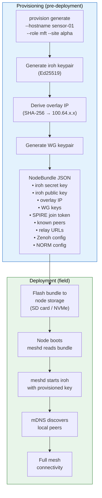

```
PROVISIONING (pre-deployment, secure facility)
═══════════════════════════════════════════════

$ cargo run --bin provision -- generate \
    --hostname sensor-01 \
    --role mft \
    --site alpha \
    --platform aarch64

    Step 1: Generate iroh keypair (Ed25519)
             ├── Secret key → bundle (32 bytes, encrypted at rest)
             └── Public key → permanent node identity

    Step 2: Derive overlay IP
             └── SHA-256(public_key) → 100.64.x.x

    Step 3: Assemble NodeBundle
             ┌───────────────────────────────────┐
             │ sensor-01.json                     │
             │                                   │
             │ version: 1                        │
             │ hostname: "sensor-01"             │
             │ role: "mft"                       │
             │ site: "alpha"                     │
             │ platform: "aarch64"               │
             │                                   │
             │ iroh_secret_key: [32 bytes]       │
             │ iroh_public_key: "7f3a..."        │
             │ overlay_ip: "100.64.42.17"        │
             │                                   │
             │ spire_join_token: "abc123..."      │
             │ spire_trust_domain:               │
             │   "alpha.desertbread.net"         │
             │                                   │
             │ relay_urls:                       │
             │   - relay.desertbread.net          │
             │   - relay-isr.desertbread.net      │
             │   - relay-mum.desertbread.net      │
             │                                   │
             │ zenoh_mode: "client"              │
             │ norm_multicast: "239.255.0.1:6003"│
             │ norm_fec_ratio: 0.2               │
             └───────────────────────────────────┘

    Step 4: Flash to node storage (SD card, NVMe)

DEPLOYMENT (field, potentially no internet)
═══════════════════════════════════════════

    Node boots → meshd reads bundle → starts iroh with provisioned key
    → mDNS discovers peers → handshakes → WireGuard overlay active
    → Zenoh connects to CP router → SPIRE agent gets SVID from CP
    → Full mesh operational (seconds, not minutes)
```

---

## 12. Security Boundaries

Four trust zones with progressive encryption. Defense-in-depth: compromise of any single layer does not expose mission data.

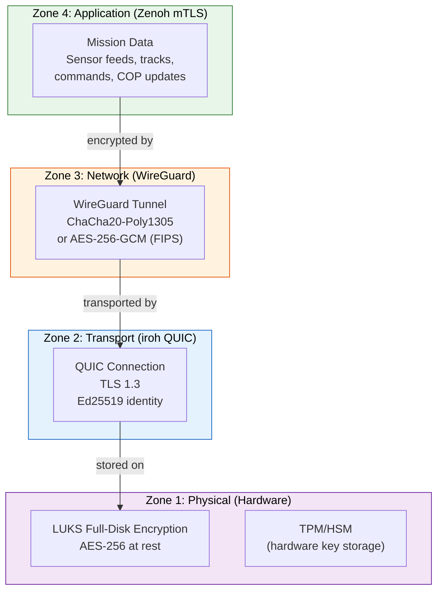

```
┌────────────────────────────────────────────────────────────────┐
│  ZONE 4: APPLICATION                                           │
│  Zenoh mTLS with SPIRE X.509-SVIDs (1-24hr lifetime)          │
│  Topic-level access control via SPIFFE IDs                     │
│                                                                │
│  ┌────────────────────────────────────────────────────────┐    │
│  │  ZONE 3: NETWORK                                       │    │
│  │  WireGuard tunnel (ChaCha20-Poly1305 or AES-256-GCM)   │    │
│  │  Drops unrecognized packets silently (stealth)          │    │
│  │                                                         │    │
│  │  ┌──────────────────────────────────────────────────┐   │    │
│  │  │  ZONE 2: TRANSPORT                               │   │    │
│  │  │  iroh QUIC (TLS 1.3, Ed25519)                    │   │    │
│  │  │  End-to-end encrypted, relay cannot decrypt       │   │    │
│  │  │                                                   │   │    │
│  │  │  ┌────────────────────────────────────────────┐  │   │    │
│  │  │  │  ZONE 1: PHYSICAL                          │  │   │    │
│  │  │  │  LUKS full-disk encryption (AES-256)       │  │   │    │
│  │  │  │  TPM/HSM key storage (Phase 4)             │  │   │    │
│  │  │  │  Tamper-evident hardware (Phase 4)         │  │   │    │
│  │  │  └────────────────────────────────────────────┘  │   │    │
│  │  └──────────────────────────────────────────────────┘   │    │
│  └─────────────────────────────────────────────────────────┘    │
└────────────────────────────────────────────────────────────────┘
```

### What each layer protects against

| Zone | Technology | Protects against |
|---|---|---|
| Zone 1: Physical | LUKS + TPM | Device capture, disk forensics |
| Zone 2: Transport | iroh QUIC / TLS 1.3 | Network eavesdropping, relay compromise |
| Zone 3: Network | WireGuard | IP-layer interception, unauthenticated access |
| Zone 4: Application | Zenoh mTLS / SPIRE | Unauthorized workload access, topic-level policy |

### What an attacker sees at each vantage point

| Vantage point | Sees | Cannot see |
|---|---|---|
| Internet observer | Encrypted QUIC packets to relay | Any content, peer identities (beyond IP) |
| Compromised relay | Encrypted QUIC packets | Anything — cannot decrypt (end-to-end) |
| LAN sniffer | WireGuard UDP packets | Content, peer IPs (encrypted), service fingerprints |
| Captured disk (powered off) | LUKS ciphertext | Anything without LUKS passphrase |

WireGuard drops packets not signed with a known key. No response, no fingerprint. To a scanner, a Desert Bread node looks like a dead IP address.

---

## 13. Cloud Infrastructure

Three iroh relay servers in geographically diverse AWS regions. Cloudflare handles DNS only. Relays are stateless — they cannot decrypt any traffic.

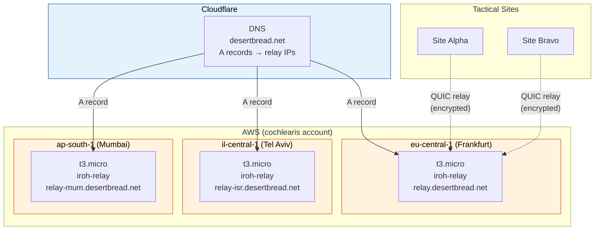

```
                    ┌──────────────────────────┐
                    │      Cloudflare DNS      │
                    │                          │
                    │  relay.desertbread.net    │  A → Frankfurt EIP
                    │  relay-isr.desertbread.  │  A → Tel Aviv EIP
                    │  relay-mum.desertbread.  │  A → Mumbai EIP
                    └──────────┬───────────────┘
                               │
            ┌──────────────────┼──────────────────┐
            │                  │                  │
     ┌──────▼──────┐    ┌─────▼──────┐    ┌──────▼──────┐
     │  Frankfurt  │    │  Tel Aviv  │    │   Mumbai    │
     │ eu-central-1│    │il-central-1│    │ ap-south-1  │
     │             │    │            │    │             │
     │  t3.micro   │    │  t3.micro  │    │  t3.micro   │
     │  Ubuntu 24  │    │  Ubuntu 24 │    │  Ubuntu 24  │
     │  iroh-relay │    │  iroh-relay│    │  iroh-relay │
     │  systemd    │    │  systemd   │    │  systemd    │
     │             │    │            │    │             │
     │  VPC 10.0   │    │  VPC 10.0  │    │  VPC 10.0   │
     │  EIP + SG   │    │  EIP + SG  │    │  EIP + SG   │
     └──────┬──────┘    └─────┬──────┘    └──────┬──────┘
            │                 │                  │
            └─────── iroh QUIC relay ────────────┘
                     (encrypted, stateless)
                              │
               ┌──────────────┼──────────────┐
               │              │              │
          Site Alpha     Site Bravo     Site Charlie
          (LAN)          (LAN)          (LAN)

     Relays are stateless. They forward encrypted QUIC packets.
     They cannot decrypt traffic. They have no knowledge of
     mesh topology, peer identities, or mission data.

     Terraform: terraform/main.tf + modules/relay/
     Provisioned via: aws-vault exec cochlearis -- terraform apply
```

### Per-relay infrastructure (Terraform)

Each relay module creates:

| Resource | Purpose |
|---|---|
| VPC + public subnet | Network isolation |
| Internet Gateway | Outbound + relay traffic |
| Security Group | HTTPS (443) + iroh relay (3340) inbound |
| EC2 (t3.micro, Ubuntu 24.04) | iroh-relay binary + systemd |
| Elastic IP | Stable public IP for DNS |
| Cloudflare DNS A record | `relay*.desertbread.net` |
| SSH key (Secrets Manager) | Emergency access only |

---

## 14. Docker Dev Environment

The dev environment simulates a 3-node site (1 CP + 2 MFTs) on a Docker bridge network. mDNS discovery works across containers. WireGuard interfaces are created inside containers with `NET_ADMIN` capability.

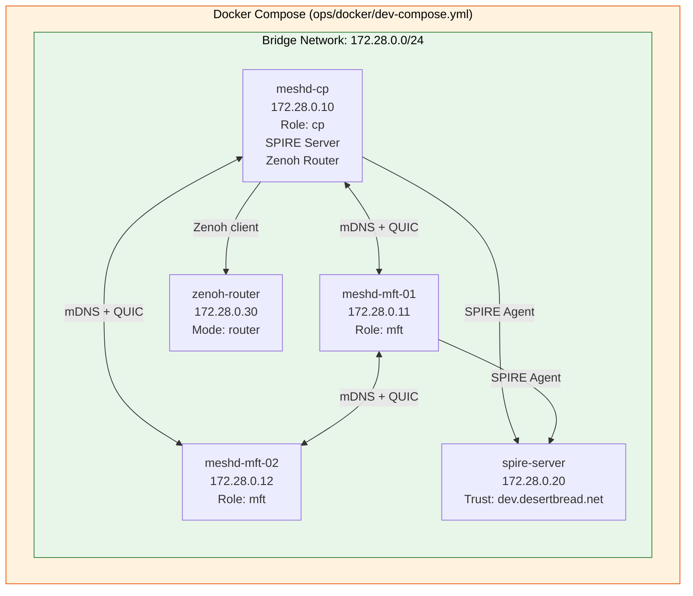

```
┌──────────────────────────────────────────────────────────────────┐
│  Docker Compose Dev Environment                                  │
│  ops/docker/dev-compose.yml                                      │
│                                                                  │
│  Bridge Network: desertbread-dev (172.28.0.0/24)                 │
│  ┌────────────────────────────────────────────────────────────┐  │
│  │                                                            │  │
│  │  ┌──────────────┐  ┌──────────────┐  ┌──────────────┐     │  │
│  │  │  meshd-cp    │  │ meshd-mft-01 │  │ meshd-mft-02 │     │  │
│  │  │  172.28.0.10 │  │ 172.28.0.11  │  │ 172.28.0.12  │     │  │
│  │  │              │  │              │  │              │     │  │
│  │  │  --role cp   │  │  --role mft  │  │  --role mft  │     │  │
│  │  │  --no-relay  │  │  --no-relay  │  │  --no-relay  │     │  │
│  │  │  --site dev  │  │  --site dev  │  │  --site dev  │     │  │
│  │  │              │  │              │  │              │     │  │
│  │  │  NET_ADMIN   │  │  NET_ADMIN   │  │  NET_ADMIN   │     │  │
│  │  │  (WireGuard) │  │  (WireGuard) │  │  (WireGuard) │     │  │
│  │  └──────┬───────┘  └──────┬───────┘  └──────┬───────┘     │  │
│  │         │                 │                 │              │  │
│  │         └─── mDNS discovery + QUIC P2P ─────┘              │  │
│  │                                                            │  │
│  │  ┌──────────────┐  ┌──────────────┐                        │  │
│  │  │ spire-server │  │ zenoh-router │                        │  │
│  │  │ 172.28.0.20  │  │ 172.28.0.30  │                        │  │
│  │  │              │  │              │                        │  │
│  │  │ Trust domain:│  │ Mode: router │                        │  │
│  │  │ dev.desert   │  │ Multicast    │                        │  │
│  │  │ bread.net    │  │ scouting     │                        │  │
│  │  └──────────────┘  └──────────────┘                        │  │
│  └────────────────────────────────────────────────────────────┘  │
│                                                                  │
│  Start: docker compose -f ops/docker/dev-compose.yml up --build  │
│  Test:  docker exec meshd-cp fabric-cli --socket /tmp/meshd.sock │
│         peers                                                    │
└──────────────────────────────────────────────────────────────────┘
```

### Dev container capabilities

| Container | Image | Capabilities | Purpose |
|---|---|---|---|
| meshd-cp | Dockerfile.meshd | NET_ADMIN, NET_RAW | CP node with WireGuard |
| meshd-mft-01 | Dockerfile.meshd | NET_ADMIN, NET_RAW | MFT node |
| meshd-mft-02 | Dockerfile.meshd | NET_ADMIN, NET_RAW | MFT node |
| spire-server | Dockerfile.spire | — | SPIRE CA for dev trust domain |
| zenoh-router | eclipse/zenoh:latest | — | Zenoh router with storage |

---

## Diagram Index

Quick reference for which diagram answers which question:

| Question | Diagram |
|---|---|
| How does the system work at a high level? | [1. System Overview](#1-system-overview) |
| What does meshd do internally? | [2. meshd Architecture](#2-meshd-architecture) |
| How do nodes find each other? | [3. Connection Plane](#3-connection-plane-iroh) |
| What happens when two nodes connect? | [4. Peer Handshake Protocol](#4-peer-handshake-protocol) |
| How does WireGuard fit in? | [5. IP Overlay](#5-ip-overlay-wireguard) |
| How are overlay IPs assigned? | [6. Deterministic IP Assignment](#6-deterministic-ip-assignment) |
| What does a multi-site deployment look like? | [7. Multi-Site Topology](#7-multi-site-topology) |
| What works without internet? | [8. Island Mode](#8-island-mode) |
| How does identity and trust work? | [9. Identity and Trust](#9-identity-and-trust) |
| How does data flow from sensor to action? | [10. Data Flow](#10-data-flow-sensor-to-decision) |
| How are nodes provisioned? | [11. Provisioning](#11-provisioning-and-enrollment) |
| What are the encryption layers? | [12. Security Boundaries](#12-security-boundaries) |
| What runs in the cloud? | [13. Cloud Infrastructure](#13-cloud-infrastructure) |
| How do I run a local dev environment? | [14. Docker Dev Environment](#14-docker-dev-environment) |
